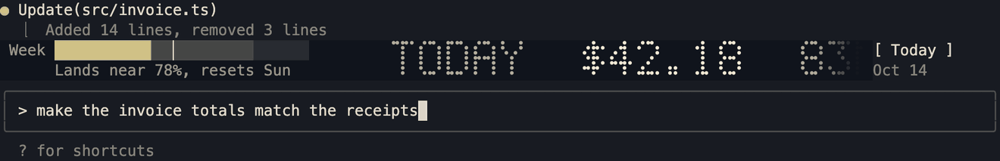
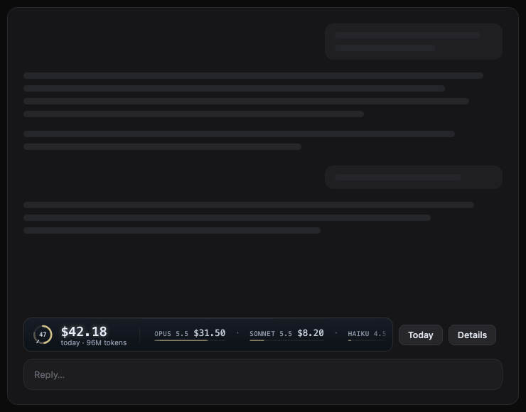

# claude-usage-meter

A usage board for Claude Code, in the terminal and in the desktop app. It shows what today (or this week, this month, all time) has cost, model by model, and where your weekly limit is heading.

## Terminal

Two rows above the prompt: a weekly pace gauge on the left and an LED-style crawl of spend per model on the right. One button steps the period.



## Desktop app

A slim strip above the prompt with the weekly ring, the total, and a crawl of the models. The **Details** button opens a pane with period tabs, a bar for each model, a 14-day sparkline and the weekly ring.



The demos are drawn by the mod's own code from invented figures. The real app's fonts and spacing differ a little.

## What it shows

- **Spend.** Total and per model, biggest first, for Today, This week, This month or All time. "This week" starts at your last weekly-limit reset. Prices are [ccusage](https://github.com/ryoppippi/ccusage) API-equivalent estimates, not what you are billed. They include every agent ccusage reports on.
- **Weekly limit.** The fill is what you have used. The faint extension is where you land if the rest of the week runs at the pace so far. The notch is where the calendar says you should be. The caption says it in words: `Lands near 82%, resets Mon` or `Runs out Sat 22:00`. The forecast is a straight line, so it runs pessimistic over nights and weekends.
- **Motion.** The terminal crawl never stops. It drifts when you are idle and speeds up with your spending pace. The desktop strip moves at one constant speed.

## Requirements

- Claude Code 2.1.287 or later, with hooks modules enabled for your account (see [Caveats](#caveats)).
- `ccusage` on your `PATH`.
- A plan that reports a seven-day limit. Without one, the gauge and the ring stay hidden.
- Terminal: 24-bit color and braille characters. It was built against Ghostty on macOS.

## Install

1. Install ccusage.

   ```sh
   npm install -g ccusage
   ```

2. Add the marketplace.

   ```sh
   claude plugin marketplace add aycandv/claude-usage-meter
   ```

3. Install the plugin.

   ```sh
   claude plugin install usage-ticker@claude-usage-meter
   ```

4. Load the plugin. In the terminal, run `/reload-plugins`. In the desktop app, restart the Code tab or open a new session.

   The board shows above the prompt.

To update, run `claude plugin marketplace update claude-usage-meter`, then `claude plugin update usage-ticker@claude-usage-meter`, then load the plugin again as in step 4.

## How it works

- **Data.** One `ccusage daily --json --breakdown` read gives every day. All four periods are added up from it. It runs when a session starts, after a turn, and every 5 minutes. Local time comes from your machine.
- **Limits.** The engine pushes the seven-day window to the mod when it moves, so nothing is polled.
- **Terminal.** The board is one two-row `Raster`, repainted in place with `$.ui.blit`. From 100 columns it has the full layout and the period button. Narrower terminals get less. Under 50 columns you get one line of text.
- **Desktop.** The app has no `Raster`, so the strip is an `Svg` image. The app reloads an interactive `Svg` each time it draws the band again, so the strip is a plain image and its figures wait while Claude works. They update about 15 seconds after a turn ends, at most every 5 minutes. A period or tab press updates at once. The pane draws its figures as native text, which updates in place.

## Caveats

- Hooks modules sit behind a rollout flag, `tengu_plugin_hooks_modules`. If Claude Code says hooks modules are turned off, the mod cannot load until the flag is on for your account.
- Only the seven-day window is drawn. Other limit kinds, such as a gateway spend limit, are ignored.
- The desktop strip has no hover tooltips. The Details pane has the full figures.
- The desktop layout was checked in the real app on macOS only. Other platforms are untested.

## Development

```sh
dev/test.sh                                   # pure-module tests under bun, no engine needed
claude plugin test plugins/usage-ticker       # everything, including the engine mount tests
claude plugin validate . --strict
```

To type-check, load the mod once so Claude Code writes its type declarations, then run `tsc -p .claude-plugin/types/tsconfig.json` inside `plugins/usage-ticker`.

Code is in `plugins/usage-ticker/hooks/`. `register.tsx` wires the engine's events and timers to the modules. The other files each do one thing and have a `.test.ts` beside them: the terminal board (`board`, `led`, `gauge`, `scroll`, `pace`), the data (`cards`, `periods`, `zone`) and the desktop drawings (`strip-svg`, `ring-svg`, `pane-view`, `desktop-state`, `desktop-theme`). `dev/design/render.ts` renders the design scenes.

## License

MIT. See [LICENSE](LICENSE).
